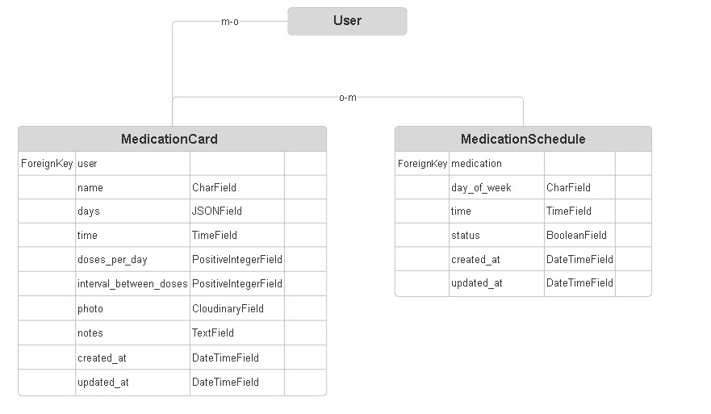

# **Medication Assistant**

Medication Assistant is a user-friendly web application designed to help users track their medication schedules effectively. With features like CRUD functionality, medication reminders, and weekly overview, this tool simplifies medication management for its users.

The responsive website allows registered users to add medication and create medication schedule. Users who are not registered are free to see the Home page. To make it easy to find right day in the schedule, users can reverse medication schedule and collapse unwanted days.

# **[Link to Live Site](https://dividewise-a9f60e19a4b9.herokuapp.com/)**  

*This project was built as part of a full-stack development portfolio.*

**Built by Oleksii Aleferchuk**

---

# **Table of Contents**  

 1. [ UX ](#ux)
 2. [ Agile Development ](#agile-development)
 3. [ Features implemented ](#features-implemented)  
 4. [ Features Left to Implement ](#features-left-to-implement)  
 5. [ Technology used ](#technology-used) 
 6. [ Testing ](#testing-and-Validation)  
 7. [ Bugs ](#known-bugs)  
 8. [ Deployment](#deployment)
 9. [ Resources ](#resources)  
 10. [ Credits and acknowledgements ](#credits-and-acknowledgements)

---

# **UX**

## Entity Relationship Model

I used smartdraw.com to create my database entity relationship diagrams. See diagram and supporting text below.

## UX Design

## **Overview**
Medication Assitant is created for users who need to take medications and want to remeber about all of them. The app simplifies tracking medication, ensuring simplicity and confidentiality.

### Users
Medication Assistant is aimed at individuals who need to manage their medication schedules, including people with chronic conditions, elderly users, and those on multiple medications. These users seek a straightforward, reliable platform to track their medications, ensure timely intake, and maintain consistency in their treatment plans.

### Goal
Medication Assistant helps users stay on top of their medication by offering a customizable platform to track doses, times, and status (taken or not taken). The goal is to provide a simple yet effective tool that promotes organization, adherence to prescribed schedules, and peace of mind for users managing their health.

## Wireframes

The following wireframes illustrate the design and functionality envisioned for key pages and views in the application. Each layout ensures a responsive and user-friendly experience across various devices, including mobile.

### Index Page (Desktop and Mobile)

The index page serves as the main dashboard for users, displaying a list of their created spaces. It includes clear navigation options and responsive design to ensure seamless accessibility on smaller screens.

---

### View Space (Desktop and Mobile)

The view space page provides detailed information about a specific space, including the associated expense lines and contributors. It ensures clear and organized presentation of data.

---

### Forms and Confirmation Messages

The wireframes for the forms include layouts for creating or editing spaces, expenses, and contributors. These forms prioritize simplicity and clarity for user input.

A confirmation message appears on the index page after actions like adding or editing spaces. This feedback ensures users are informed about the success of their actions.

---

## **Agile Development**