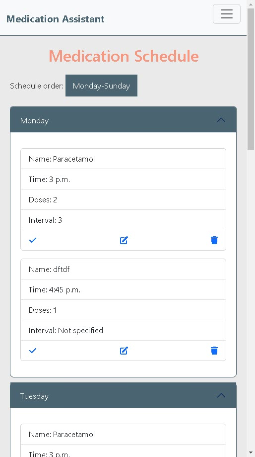
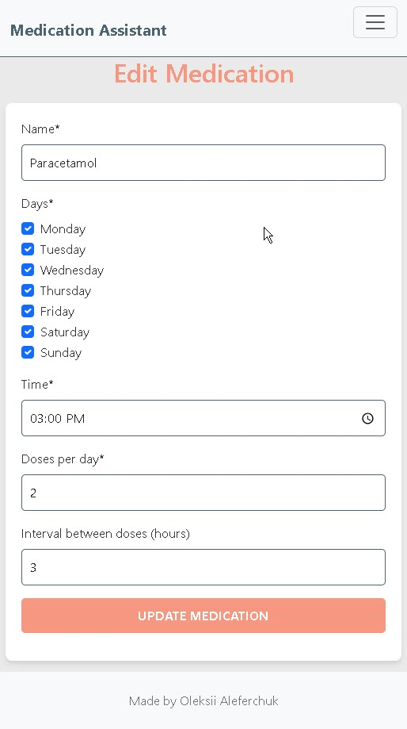

# **Medication Assistant**

Medication Assistant is a user-friendly web application designed to help users track their medication schedules effectively. With features like CRUD functionality, medication reminders, and weekly overview, this tool simplifies medication management for its users.

The responsive website allows registered users to add medication and create medication schedule. Users who are not registered are free to see the Home page. To make it easy to find right day in the schedule, users can reverse medication schedule and collapse unwanted days.

# **[Link to Live Site](https://medicine-taker-993fd18628d0.herokuapp.com/)**  

*This project was built as part of a full-stack development portfolio.*

**Built by Oleksii Aleferchuk**

---

# **Table of Contents**  

 1. [ UX ](#ux)
 2. [ Agile Development ](#agile-development)
 3. [ Features implemented ](#features-implemented)  
 4. [ Features Left to Implement ](#features-left-to-implement)  
 5. [ Technology used ](#technology-used) 
 6. [ Testing ](#testing-and-Validation)  
 7. [ Bugs ](#known-bugs)  
 8. [ Deployment](#deployment)
 9. [ Resources ](#resources)  
 10. [ Credits and acknowledgements ](#credits-and-acknowledgements)

---

# **UX**

## Entity Relationship Model

I used smartdraw.com to create my database entity relationship diagrams. See diagram and supporting text below.

## UX Design

## **Overview**
Medication Assitant is created for users who need to take medications and want to remeber about all of them. The app simplifies tracking medication, ensuring simplicity and confidentiality.

### Users
Medication Assistant is aimed at individuals who need to manage their medication schedules, including people with chronic conditions, elderly users, and those on multiple medications. These users seek a straightforward, reliable platform to track their medications, ensure timely intake, and maintain consistency in their treatment plans.

### Goal
Medication Assistant helps users stay on top of their medication by offering a customizable platform to track doses, times, and status (taken or not taken). The goal is to provide a simple yet effective tool that promotes organization, adherence to prescribed schedules, and peace of mind for users managing their health.

## Wireframes

The following wireframes illustrate the design and functionality envisioned for key pages and views in the application. Each layout ensures a responsive and user-friendly experience across various devices, including mobile.

### Home Page

The home page serves as the about page where user can find the purpose of the site and the implemented features. It includes clear description of the site and call to action button that redirects to Register page.

---

### Medication List

The Medication List page provides schedule for taking medication depending on the detail that users provide. It ensures clear and organized presentation of data.

---

### Forms

The wireframes for the forms include layouts for creating or editing medications. These forms prioritize simplicity and clarity for user input.

A confirmation message appears on the index page after actions like adding or editing spaces. This feedback ensures users are informed about the success of their actions.

---

# **Agile Development**

For the development of Medication Assistant, I adopted an Agile methodology to ensure iterative and efficient progress throughout the project lifecycle. Central to this approach was the utilization of a Kanban board hosted on GitHub Projects. You can view the project board [here](https://github.com/users/Oleksii-Al/projects/4/views/1).

## Kanban Board Overview

The Kanban board served as a visual representation of the project's progress and allowed for effective task management. It consisted of the following sections:

- **Backlog:** This section contained all the tasks and user stories that were yet to be prioritized for implementation.
- **Todo:** Tasks and user stories ready for development were moved to this column.
- **In Progress:** Work in progress was tracked here, indicating tasks actively being worked on.
- **Testing:** Upon completion, tasks were moved here for testing before being marked as done.
- **Done:** Tasks that were completed successfully were moved to this column.

### User Stories Integration

User stories played a pivotal role in shaping the development process, ensuring that features were aligned with user needs. These user stories were mapped onto the Kanban board, guiding the prioritization and implementation of tasks. 

### Task Management

In addition to tracking user stories, the Kanban board served as a comprehensive task list. I utilized it to break down user stories into smaller, actionable tasks, ensuring clear and manageable objectives for development. This granular approach facilitated efficient progress tracking and enhanced team collaboration.

By leveraging Agile principles and utilizing the Kanban board effectively, the development of Medication Assistant remained focused, adaptable, and responsive to evolving requirements, resulting in a more robust and user-centric Django blog application.

## User Stories Overview

1. **Title:** Registration
   - As a user, I want to register an account so that I can securely save and access my medication schedules.

2. **Title:** Login
   - As a user, I want to log in to my account so that I can access my personalized medication data.

3. **Title:** Logout
   - As a user, I want to log out of my account so that my data remains secure when I’m done using the site.

4. **Title:** Add Medication
   - As a user, I want to easily create a new medication card so that I can track my medication schedule efficiently.

5. **Title:** Take/Untake medication
   - As a user, I want to mark medication as taken/untaken so that I can manage my daily doses efficiently.

6. **Title:** Edit medication
   - As a user, I want to edit medication cards so that I can keep my medication schedule up to date.

7. **Title:** Delete medication
   - As a user, I want to delete medication cards so that I can keep my medication schedule up to date.

8. **Title:** Medication List
   - As a user, I want to see my medication cards displayed by days of the week (Monday to Sunday) so that I can easily navigate my medication schedule for the entire week.

9. **Title:** Revers days order
   - As a user, I want to reverse the week so that I can quickly find the information I need.

10. **Title:** Collapsing/expanding the medication day
   - As a user, I want to collapse the days of the week so that I can focus on specific days or manage my schedule with more space.

11. **Title:** Home page for unauthenticated users
   - As a user, I want to see a homepage with general information about the site so that I understand its features and how to use them.

12. **Title:** Navigation
   - As a user, I want to easily navigate through the site so that I can quickly access all the features and information I need.

13. **Title:** Alert messages
   - As a user, I want to receive feedback through alert messages so that I know when my actions are successful or if there are any issues.

# Features Implemented

## Home page:
  - General information is displayed
  - Call to action button is displayed and redirects to Register page
  - Register button is displayed
  - Login button is displayed

## Medication List page:
  - The days of the week are rendered
  - Correct medication is displayed in each day
  - Order button can reverse the days
  - Each day can be collapsed/expanded

## Actions:
  - Take button is displayed next to every medication
  - Edit button is displayed next to every medication
  - Delete button is displayed next to every medication
  - Each button has a correct link
  - ALert message is displayed after every action with success or error result

## Delete modal:
  - Delete button call the Delete modal
  - User need to confirm deletion in the modal

## Add Medication form
   - Crispy form is rendered
   - Necessary fields is displayed
   - Filled fields allow medication to be correctly displayed on the Medication List 

## Login Page:
  - Secure signup functionality allows users to register securely.
  - Successful login redirects users to the Medication List page.

## Registration Page:
  - Secure login functionality allows users to log in securely.
  - Successful registration redirects users to the Medication List page.

## Logout Page:
  - Logout functionality allows users to sign out securely.
  - After successful logout, users are redirected to the Home page.

### Responsive Design:

   - The website is designed to be responsive, ensuring optimal usability across various screen sizes.
   - Navbar collapses into a burger bar for improved navigation on smaller screens.
   - The medication card is changed for smaller screen to provide better readability

# Technology Stack

- HTML - for page structure
- CSS - for custom styling
- Python - for the backend
- Javascript - for filtering and deliting functionality
- Django - framework used to build this project
- Bootstrap 5 - front end framework used for styling
- Heroku PostgreSQL - used as the database
- Balsamiq - for wireframes
- Font Awesome - for social media icons
- Smartdraw - for database ER diagrams
- GitHub - for storing the code and for the Kanban board
- Heroku - for hosting and deployement of this project
- Git - for version control

# Testing and Validation

## Responsiveness

The app was tested across multiple devices (desktop, tablet, mobile) using Chrome DevTools.

### The Home page

|  | 

### The Medication List page

|  | 

### The Add/Edit Medication page

|  | 
|  | 
